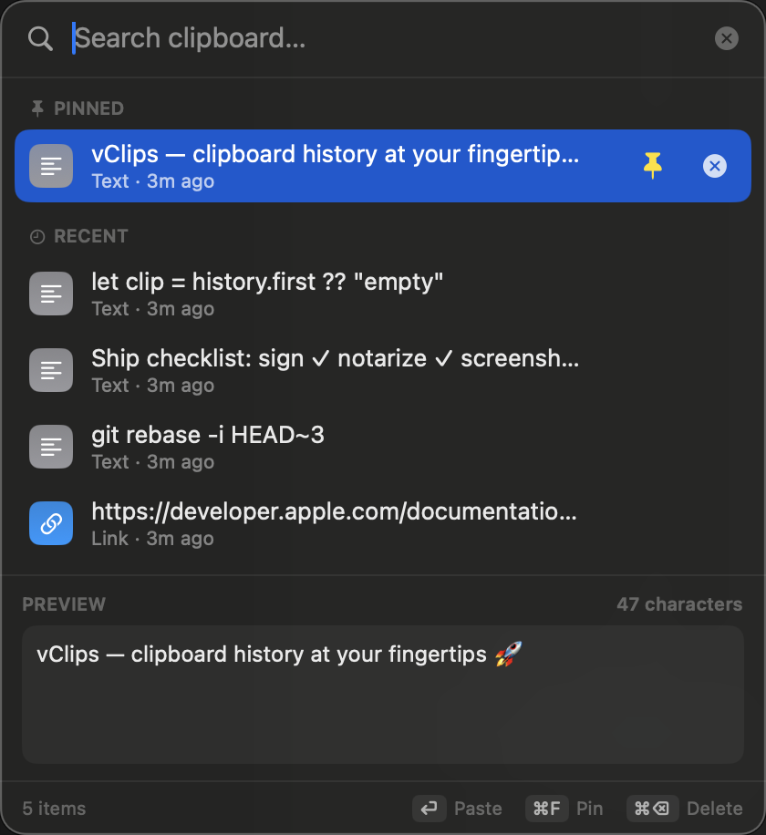

# vClips

A macOS-native menu-bar clipboard manager: text history, search, and pinned favorites,
summoned anywhere with ⌘⇧V and auto-pasted into the focused app.

<p align="center">
  
</p>

## Install
Download the latest `vClips-x.y.z.zip` from
[Releases](https://github.com/ulBible/vClips/releases), unzip, and drag
`vClips.app` into `/Applications`. Requires macOS 14+.

## Building from source

### Requirements
- macOS 14+
- Full Xcode (SwiftData macros are not in Command Line Tools)

### Build & run
```bash
./scripts/setup-signing.sh          # once per machine — see "Signing" below
./scripts/bundle.sh release install  # builds, signs, copies to /Applications
open /Applications/vClips.app
```

### Signing (why a one-time setup)
macOS ties the Accessibility permission (which powers auto-paste) to the app's
code-signing identity. Ad-hoc signing produces a *new* identity on every build,
so the permission silently resets each rebuild and auto-paste stops working
(copy-only fallback) even though the toggle still looks enabled.

`scripts/setup-signing.sh` creates a stable self-signed "vClips Self Signed"
identity in your login keychain (once). `bundle.sh` then signs with it, so the
permission persists across rebuilds. Without it, the build falls back to ad-hoc
and you must re-grant Accessibility after every rebuild.

## First run
1. Grant Accessibility access when prompted, or via **System Settings → Privacy &
   Security → Accessibility** — enable **/Applications/vClips.app**. (Remove any
   stale vClips entries first.) Without it, vClips falls back to copy-only —
   selected items go to the clipboard for manual ⌘V.

## Usage
- **⌘⇧V** — open the history popup (near the mouse)
- **type** — filter; **↑/↓** — move; **⏎** — paste; **⌘F** — pin/unpin; **esc** — close
- Menu-bar icon → History / Quit

## Privacy
All history is stored locally via SwiftData. Items marked concealed/transient
(e.g. password managers) are never captured. No network access.

## Defaults
Polling 0.5s · max 200 unpinned items · hotkey ⌘⇧V · text only.

## Support
vClips is free. If it saves you time, you can support development here:
<!-- TODO: replace with the real donation link once the account exists
     (GitHub Sponsors / Ko-fi / Buy Me a Coffee) -->
[Sponsor vClips ❤️](https://github.com/sponsors/ulBible)

## Releasing (maintainer)
```bash
./scripts/release.sh 1.0.0   # build → Developer ID sign → notarize → dist/vClips-1.0.0.zip
```
See the header of [scripts/release.sh](scripts/release.sh) for the one-time
certificate and notary-credential setup.

## License
[MIT](LICENSE)
